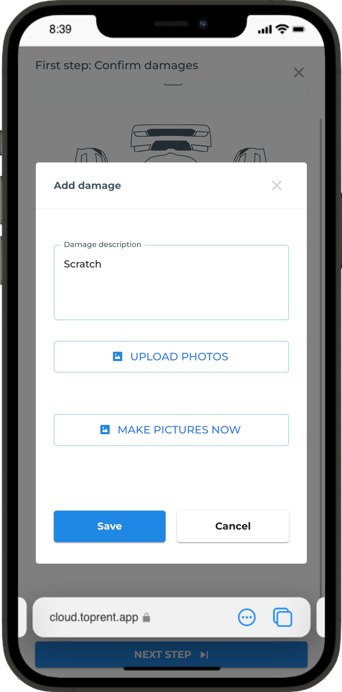

# Technical task for the mobile application

The mobile application is [designed] to provide users with the ability to view reservations assigned to them, make check-in and check-out process.

## Technical requirements
1. The mobile app must be implemented using the [React-Native](https://reactnative.dev) framework.
2. Api calls are made using any GraphQL library.
3. The application must be able to work in offline mode, and synchronize data with the server when the connection is restored.
4. The API is already implemented and available at https://cloud.toprent.app/api/graphql.
5. Authentication is implemented using the Firebase Authentication service.

## User stories
1. As a user, I want to be able to log in to the application using my credentials or Google account.
2. As a user, I want to be able to view the list of reservations assigned to me.
3. As a user, I want to be able to view the details of the reservation.
4. As a user, I want to be able to make a check-in process.
5. As a user, I want to be able to make a check-out process.

## Features

### Login
The user must be able to log in using the following methods:
1. Using the username and password.
2. Using Google account.

### Reservations list
The user must be able to view the list of reservations assigned to him.
The list consists from two tabs: Relevant and Completed, and must contain the following information:
1. Number.
2. Status.
3. Start date.
4. End date.
5. Start address.
6. End address.
7. Action button.

### Reservation details
The user must be able to view the details of the reservation.
The details page consists of the following sections:
1. General information.
2. Check-in
3. Check-out

#### General information
The general information section contains the following information:
1. Number.
2. Status.
3. Start date.
4. End date.
5. Start address.
6. End address.
7. Car.
8. Notes.
9. Customer.

#### Check-in
The check-in section contains the following information:
1. Car.
2. Customer name.
3. Customer phone.
4. Delivery courier name.
5. Delivery courier phone.
6. Damage report with a switch Exterior/Interior.
7. Fuel level.
8. Odometer.
9. Notes.
10. Action button to start the check-in process.

#### Check-out
The check-out section contains the following information:
1. Car.
2. Customer name.
3. Customer phone.
4. Collection courier name.
5. Collection courier phone.
6. Damage report with a switch Exterior/Interior.
7. Fuel level.
8. Odometer.
9. Notes.
10. Action button to start the check-out process.

#### Screenshots

  
Reservations list relevant

  

  
Reservations list completed

  

  
General info

  

  
Start (check-in)

  

  
Start damages

  

  
Start footer

  

  
Finish done

  

  
Finish damages

  

  
Finish footer

  

  
Checkin step1

  

  
Checkin step2

  

  
Checkin step2 done

  

  
Checkin step3

  

  
Checkin step4

  

  
Checkin step4 done

  

  
Checkin signature

  

  
Checkin signature done

  

  
Checkin done

  

  
Add damage

  

  
Add damage photo

  

  
Add damage done

  

  
Damage interior

  

  
Checkout half done

  

